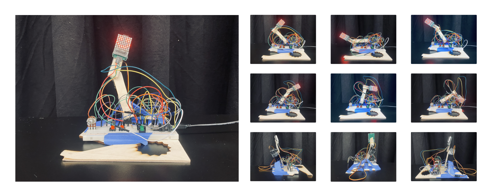
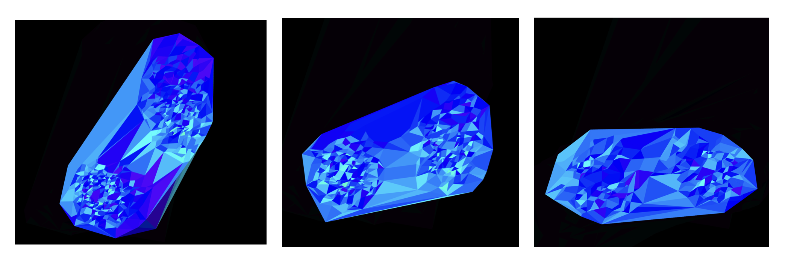
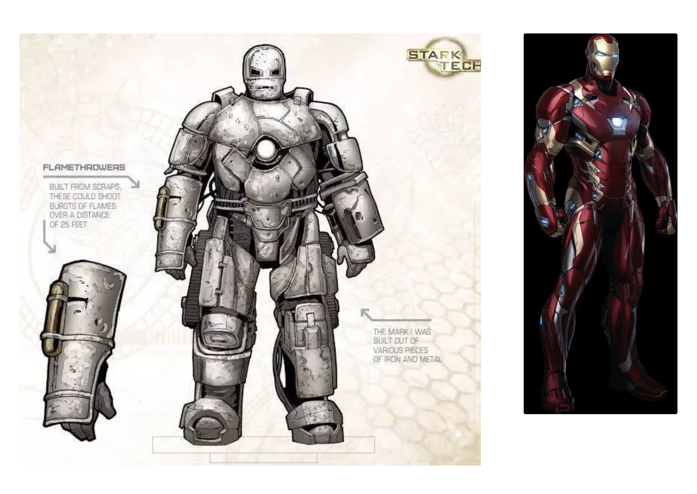

# Frankenstein: My First Tiny Robotic Arm Project

This is my midterm project for Physical Computing. I made a simple robotic arm with a smiling face, and its digital twins! I name it **Frankenstein I**, which symbolizing a creature crafted by a bunch of wasted stuff.

Four pushbuttons control the arm’ position in Cartesian space, while a potentiometer to adjusts its moving speed. When the arm moves outside its workspace, the face turns sad, smiling again when it returns to a valid position. Meanwhile, P5.js will visualize the movements of its joints, which looks like its digital twins!

This project apply following things I learnt recently:

- Digital Input
- Analog Input
- Forward Kinematics
- Inverse Kinematics

## Links

For more information, please check out the following link:

- [Video](https://drive.google.com/file/d/1DDYvQkuoxJn31Q663QZJp7O8A2DMUf7v/view) - a simple demonstration
- [Blog](https://spangle-clutch-0a2.notion.site/Week6-Midterm-Project-1268ad8589b6808fa3a2e3d39f1ea35d) - the design and build process

## Development

- Open `server/frankenstein/frankenstein.ino` by Arduino Nano 33 loT
- `cd client && npm run dev`

## Objectives

When designing this project, I had three objectives:

- Keep it as simple as possible
- Apply what I’ve learned so far
- Make it small but meaningful

This is why I used only basic components and assembled them with tap, without neatly wrapping the wires. But I’m glad that I incorporated _digital input_, _analog input_ and _inverse kinematics_ into real-world project. In the end, it is small but it is a robotic arm!

## Discussions

Some might feel sorry for Frankenstein I because it does not look good, but I’m pretty fine with it. It reminds me of Mark I—the first version of Iron Man’s suite. Though created from low-quality materials and looking rather shabby, it saved Iron Man’s life and marked a beginning of a legend!

Frankenstein I is my first tiny robotic arm. I hope it is a good starting point for my journey in Physical Computing and Robotics.

## Future work

- Dancing with music!
- Visualize the trace of the two joints!
